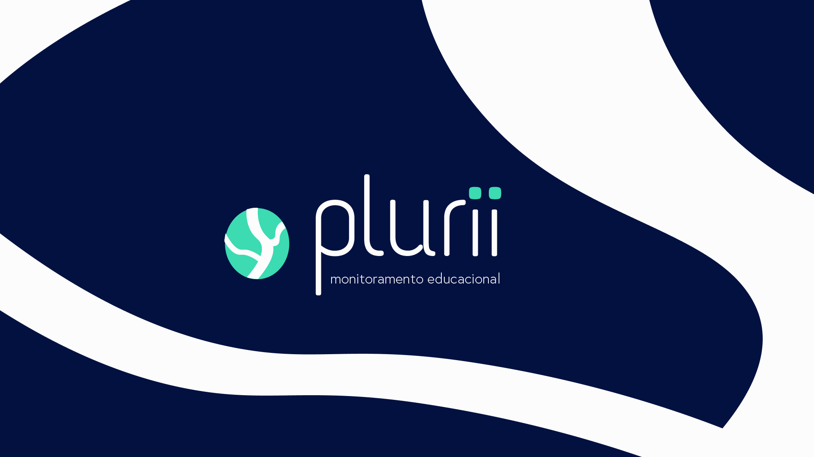
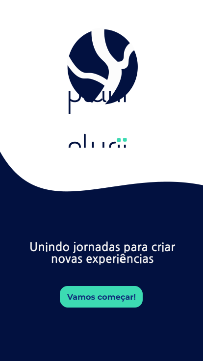
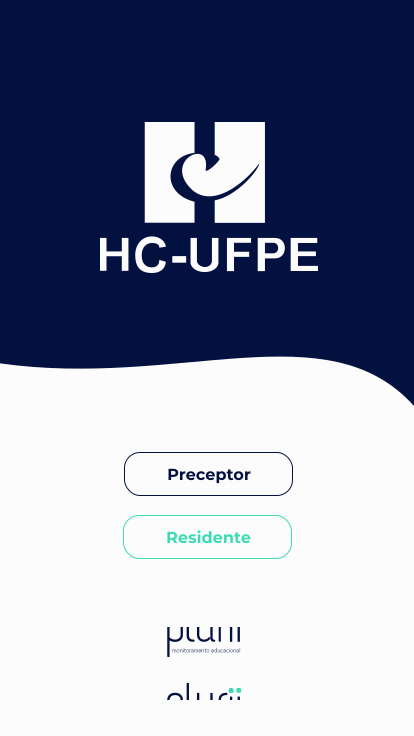
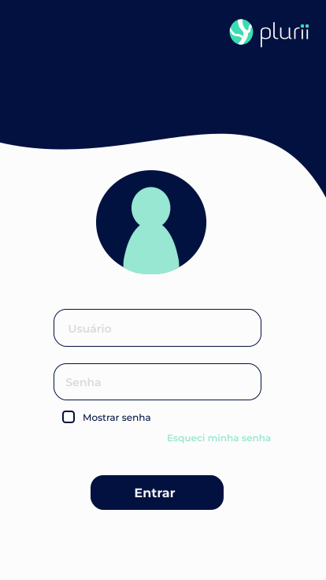
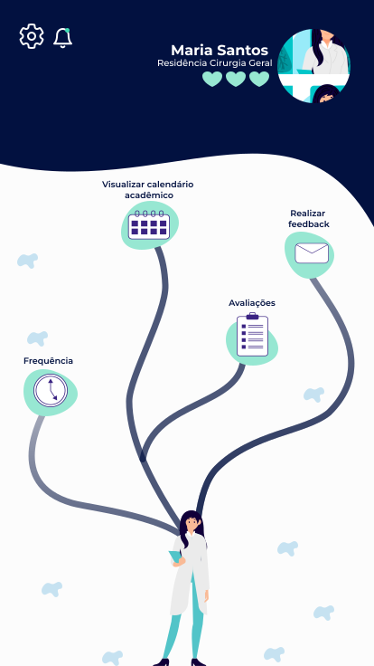
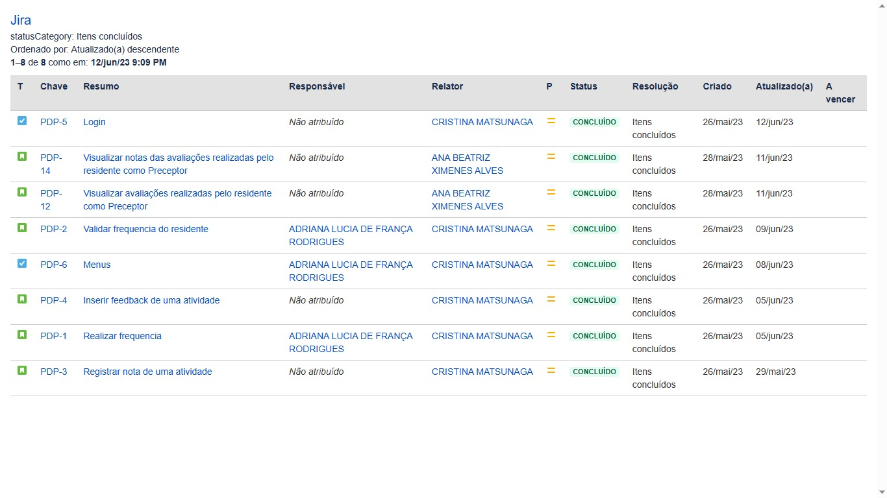
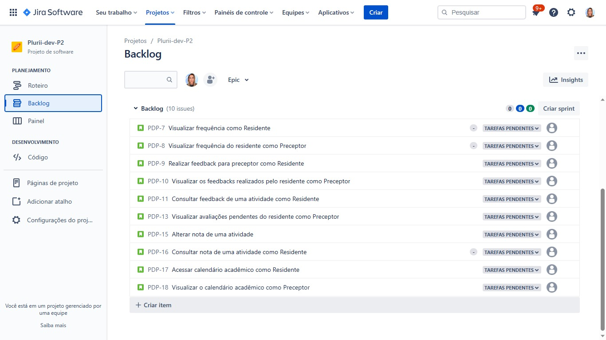

# 👁 Plurii - Monitoramento Educacional

> Unindo experiências para criar soluções Plurais!
---

## 🏥 Cliente

O Hospital das Clínicas da Universidade Federal de Pernambuco Professor Romero Marques (HC-UFPE) é um órgão suplementar da UFPE de apoio ao ensino, pesquisa extensão e assistência ep resta serviços médicos especializados de média e alta complexidade acobertados pelo SUS. Faz parte do grupo de 44 hospitais universitários geridos pela Rede Ebserh (Empresa Brasileira de Serviços Hospitalares).
- O HC auxilia no campo de prática na formação de estudantes e profissionais incluindo:
  - 15 cursos de graduação; 
  - 52 programas de residência uniprofissional e multiprofissional;
  - 13 cursos de pós-graduação.

## 👊 Problemática

Como otimizar o monitoramento da jornada dos residentes do HC garantindo a assertividade das informações?
  - Devido aos diversas especialidades de de Residência com formas de avaliação e acompanhamento diferentes  há uma grande dificuldade no Monitoramento da Jornada dos Residentes. Isso é agravado também pois os residentes não recebem feedback das atividades e as avaliações e frequencias são registrados tardiamente e em formulários de papel.

## 😎 Solução

Uma aplicação web responsiva com interface gameficada para o registro de frequencia, avaliação e feebback das atividades dos residentes de forma assertiva e instantânea para a melhoria do monitoramento dos programas residências no Hospital das Clínicas UFPE.
- Nosso processo de desenvolvimento da solução foi dividido em dois momentos: 
  - Aquisição de dados e foco no  engajamento dos residentes e preceptores através da gameficação para garantir o recebimentos dos dados de forma assertiva;
  - Após validar a primeira parte, o foco foi no refinamento  da solução para abarcar as necessidades das coordenações e núcleo de  Gestão de Educação Pesquisa para gestão e manipulação de dados e criação de métricas de avaliação de qualidade estabelecidas com o cliente.

## 🚀 Linguagem utilizada
- 

## ⚙️ Instruções de uso

1. O código pode ser executado tanto pelo .exe presente no repositório, quanto clonar o repositório para o Replit.
2. Usuários de acesso:
   - Preceptor:
       - Usuário: mferreira
       - Senha: 1234
   - Residente:
       - Usuário: msantos
       - Senha: 1234
3. Navegue pelos menus e funcionalidades através dos números:
    - Menu Preceptor:
      - 1: Frequência
      - 2: Avaliações/Feedback
      - 3: Atividade Diária
      - 4: Calendário Acadêmico
      - 5: Residentes
      - 0: Sair
   - Menu Residente:
     - 1: Frequência
     - 2: Avaliações
     - 3: Feedbacks
     - 4: Calendário Acadêmico (EM DESENVOLVIMENTO)
     - 0: Sair

## 📄 Como foi desenvolvido?

1. Iniciamos tendo em mente a nossa planilha de estrutura de dados, com isso criamos as libs que precisaríamos para desenvolver a solução.
2. Usamos as principais funcionalidades da linguagem, como:
   - Alocação de memoria dinâmica: utilizada em praticamente todo o nosso código, para evitarmos desperdício de recursos.
   - Recursividade: utilizada nos menus de navegação do programa para manter um fluxo fluido e continuo, sem a necessidade de laços infinitos
   - Ponteiros: utilizada em praticamente todo o nosso código. Para nos referenciarmos a arquivos, parâmetros de funções, entre outros.
   - Manipulação de arquivos: essencial para a nossa solução, já que precisávamos de arquivos de texto simulando bancos de dados para guardar as informações dos usuários e funcionalidades.
   - Structs: para criarmos padrões de "objetos" e utilizarmos em diferentes partes do código.
   
## 🔗 Google Sites

O Google Site é utilizado como repositório geral das atividades da equipe.
- 

## 🔗 Replit

O Replit foi utilizado como ambiente de desenvolvimento da solução da equipe.
- 
- 

## 🎨 Layout

O layout completo da aplicação está disponível no Figma:

## 📱 Telas

  

  
  
  
  
  

## ☕ Board e Backlog no Jira

- Utilizamos a metodologia ágil Scrum e o Design Thinking, junto ao quadro Kanban, para organizar e orientar o desenvolvimento da solução. A partir disso, criamos as histórias necessárias e formamos nosso board e backlog no Jira.

  

  

## 👨‍💻 Video do código no terminal

# 🤝 Integrantes da equipe
<table>
  <tr>
    <td align="center"> <b>Adriana Rodrigues</b></a> </a></td>
    <td align="center"> <b>Ana Beatriz Alves</b></a> </a></td>
    <td align="center"> <b>Ana Beatriz Rocha </b></a> </a></td>
    <td align="center"> <b>Ana Luiza Lima</b></a> </a></td>
    <td align="center"> <b>Cristina Matsunaga</b></a> </a></td>
    <td align="center"> <b>Francisco Luz</b></a> </a></td>
    <td align="center"> <b>Jorge Herbster</b></a> </a></td>
    <td align="center"> <b>Lucibelle Lemos</b></a> </a></td>
    <td align="center"> <b>Thiago Araújo</b></a> </a></td>
  </tr>
</table>
